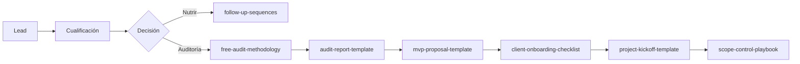

# Índice maestro de activos comerciales — PLEXAI

**Propósito:** encontrar en segundos qué documento usar en cada situación. Rutas relativas desde la raíz del repositorio.

---

## Mapa de tres packs

| Pack | Ruta | Contenido |
|------|------|-----------|
| Calidad comercial | `docs/commercial-quality-system/` | Reglas, checklist, tono, frases, revisión |
| Sistema comercial-operativo | `docs/commercial-sales-system/` | Proceso transversal venta → entrega |
| Playbooks sectoriales | `docs/commercial-sector-playbooks/` | Mensajes, demos y objeciones por sector |

Ver también: `docs/commercial-quality-system/master-commercial-map.md`.

---

## Antes de enviar algo a un cliente

1. `docs/commercial-quality-system/claim-review-checklist.md`  
2. `docs/commercial-quality-system/forbidden-and-approved-phrases.md`  
3. Si es propuesta: `mvp-proposal-template.md` exclusiones confirmadas  

---

## Qué documento usar según situación

| Situación | Documento principal | Complemento sectorial |
|-----------|---------------------|------------------------|
| Lead nuevo (cualquier canal) | `lead-qualification-framework.md` | `prospecting-messages.md` |
| Dudas si el lead es tóxico | `red-flags-and-risk-register.md` | Playbook del sector |
| Primera llamada 10 min | `discovery-call-scripts.md` | Playbook § mini-guion |
| Exploración 20 min | `discovery-call-scripts.md` | — |
| Agendar auditoría | `free-audit-methodology.md` | Playbook § preguntas auditoría |
| Ejecutar auditoría | `free-audit-methodology.md` | Playbook sector |
| Redactar informe | `audit-report-template.md` | Vocabulario del sector |
| Preparar propuesta | `mvp-proposal-template.md` + `offer-packaging.md` | Playbook § propuesta inicial |
| Objeción en llamada | `discovery-call-scripts.md` | `objections-bank.md` + playbook |
| No responde / pospone / caro | `follow-up-sequences.md` | — |
| Elegir ejemplos de automatización | `use-case-library.md` | Playbook sector |
| Definir métricas de éxito | `value-metrics-library.md` | Playbook sector |
| Cliente acepta proyecto | `client-onboarding-checklist.md` | — |
| Reunión de arranque | `project-kickoff-template.md` | — |
| Petición extra en proyecto | `scope-control-playbook.md` | — |
| Estructurar qué vender | `offer-packaging.md` | — |
| No sabes por dónde empezar | `README.md` (este pack) | `docs/commercial-sector-playbooks/README.md` |

---

## Antes de una demo

1. `docs/commercial-quality-system/commercial-safety-rules.md` — repaso límites.  
2. `lead-qualification-framework.md` — confirmar score ≥ 66 o excepción justificada.  
3. Playbook del sector — `demo-scenarios.md` + escenario concreto.  
4. `red-flags-and-risk-register.md` — repaso rápido de límites.  
5. `discovery-call-scripts.md` — cierre con siguiente paso.  
6. `value-metrics-library.md` — una métrica para mencionar sin prometer ROI mágico.

**No usar en demo:** prometer WhatsApp, calendario, voz, CRM completo.

---

## Después de una demo

1. `follow-up-sequences.md` — secuencia post-demo (email + canal usado).  
2. `free-audit-methodology.md` — si no hubo auditoría previa.  
3. `audit-report-template.md` — si ya hubo auditoría y falta informe.  
4. `sales-assets-index.md` — este índice para el equipo.

---

## Para propuesta comercial

1. `audit-report-template.md` — hallazgos previos.  
2. `mvp-proposal-template.md` — documento al cliente.  
3. `offer-packaging.md` — encajar en oferta correcta.  
4. `use-case-library.md` — UC01–UC50 como catálogo interno.  
5. `scope-control-playbook.md` — exclusiones coherentes.  
6. Playbook sector — tono y ejemplos.

---

## Para objeciones

| Tipo | Recurso |
|------|---------|
| Genéricas (30+) | `docs/commercial-sector-playbooks/objections-bank.md` |
| Por sector | `dental-clinics.md`, `podiatry-clinics.md`, `aesthetic-clinics.md`, `physio-osteopathy.md`, `academies.md`, `local-services.md` |
| WhatsApp / calendario / voz | `follow-up-sequences.md` §9 + `red-flags-and-risk-register.md` R10–R12 |
| Precio / alcance | `scope-control-playbook.md` + `offer-packaging.md` |

---

## Para onboarding y entrega

1. `client-onboarding-checklist.md`  
2. `project-kickoff-template.md`  
3. `scope-control-playbook.md`  
4. `value-metrics-library.md` — criterios de éxito  
5. `red-flags-and-risk-register.md` — riesgos de proyecto

---

## Para sectores (playbooks)

| Sector | Archivo |
|--------|---------|
| Dental | `docs/commercial-sector-playbooks/dental-clinics.md` |
| Podología | `docs/commercial-sector-playbooks/podiatry-clinics.md` |
| Estética | `docs/commercial-sector-playbooks/aesthetic-clinics.md` |
| Fisio / osteopatía | `docs/commercial-sector-playbooks/physio-osteopathy.md` |
| Academias | `docs/commercial-sector-playbooks/academies.md` |
| Servicios locales | `docs/commercial-sector-playbooks/local-services.md` |
| Demos | `docs/commercial-sector-playbooks/demo-scenarios.md` |
| Prospección | `docs/commercial-sector-playbooks/prospecting-messages.md` |
| Objeciones | `docs/commercial-sector-playbooks/objections-bank.md` |
| Índice sectorial | `docs/commercial-sector-playbooks/README.md` |

---

## Rutas relativas — `docs/commercial-sales-system/`

| Archivo | Ruta |
|---------|------|
| Índice maestro | `docs/commercial-sales-system/sales-assets-index.md` |
| README del pack | `docs/commercial-sales-system/README.md` |
| Cualificación | `docs/commercial-sales-system/lead-qualification-framework.md` |
| Auditoría metodología | `docs/commercial-sales-system/free-audit-methodology.md` |
| Plantilla informe | `docs/commercial-sales-system/audit-report-template.md` |
| Plantilla propuesta MVP | `docs/commercial-sales-system/mvp-proposal-template.md` |
| Guiones llamadas | `docs/commercial-sales-system/discovery-call-scripts.md` |
| Seguimientos | `docs/commercial-sales-system/follow-up-sequences.md` |
| Onboarding | `docs/commercial-sales-system/client-onboarding-checklist.md` |
| Kickoff | `docs/commercial-sales-system/project-kickoff-template.md` |
| Control alcance | `docs/commercial-sales-system/scope-control-playbook.md` |
| Métricas | `docs/commercial-sales-system/value-metrics-library.md` |
| 50 casos de uso | `docs/commercial-sales-system/use-case-library.md` |
| Riesgos | `docs/commercial-sales-system/red-flags-and-risk-register.md` |
| Ofertas | `docs/commercial-sales-system/offer-packaging.md` |

### Calidad comercial (`docs/commercial-quality-system/`)

| Archivo | Uso |
|---------|-----|
| `README.md` | Introducción al pack |
| `commercial-safety-rules.md` | Reglas estrictas |
| `claim-review-checklist.md` | Pre-envío obligatorio |
| `message-tone-guide.md` | Tono |
| `forbidden-and-approved-phrases.md` | 90 frases |
| `commercial-review-report.md` | Informe de revisión |
| `master-commercial-map.md` | Mapa maestro |
| `night-work-plan.md` | Plan de mantenimiento docs |

---

## Flujo visual (referencia rápida)

---

## Mensaje central (recordatorio)

> Analizamos los procesos de tu negocio, detectamos tareas repetitivas y diseñamos automatizaciones con IA solo donde realmente aportan valor.

---

## Mantenimiento del índice

Al añadir archivos a `docs/commercial-sales-system/`, actualizar:

1. Tabla de rutas en este documento.  
2. `README.md` del pack.  
3. Si afecta a promesas comerciales, playbooks sectoriales.

---

*Índice interno PLEXAI — versión pack comercial-operativo.*
